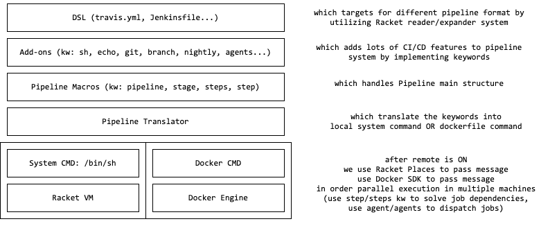

# Pipeline

These are demos for my graduation thesis.

## Design

## Codes

most are experimental or stupid:
1. Travis CI parser
2. Docker SDK/API for Racket
3. Dockerfile reader/generator
4. Pipeline macros
5. Logger
